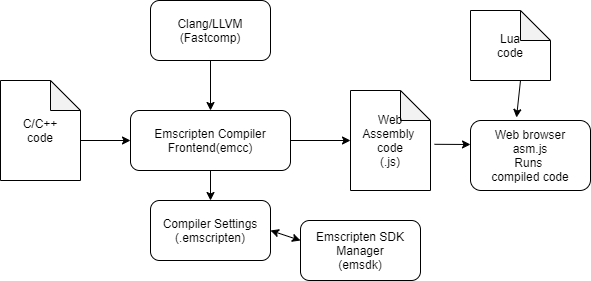
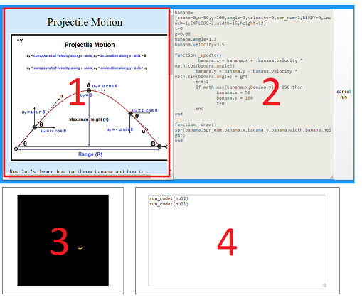
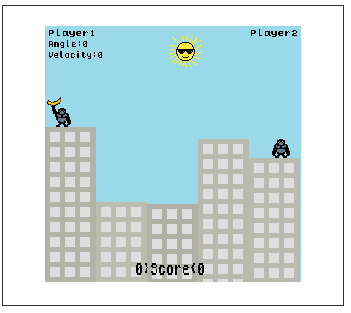

# Abstract

 This project was being done for the educational technology course from my master degree. In short, it's a bullshit project that mimicking the pico8 in webbrowser. I need to find a job, so that I'm updating it to see if any company takes a bait.
 
 it's demo can be accessed from the following address,
 
 https://suitzero.github.io/edufantasyconsole/
 
# **1 INTRODUCTION**

 The Educational Fantasy Console(EFC) intelligent tutoring system(ITS) is targeting programming, math, and physics education all at once by introducing game programming to a learner.

 Game programming is an activity of creating a small virtual universe. A developer has to implement new laws of nature inside the game which mimics or satirizes a physical world we are living and that requires and motivates us to understand real-world physics. And the puzzles that the conceptualized physical world provides, which is mathematics.

 However, using a modern commercial game development environment directly as an educational tool for that purpose is unrealistic due to its own complication. There is abundance in tools and techniques which can be daunting and distracting at the same time. Furthermore, often it is highly specialized in a way that an individual can only focus on a certain sector of game development rather than understanding the underlying principles and concepts in a holistic manner.

  The fantasy console is a popular programming platform for hobby programming and mostly used for video game programming. It has a limited environment such as having an 8bit memory capacity or 128x128 display resolution and a limited number of APIs, which can be learned in a very short time.

 Due to its simplicity, it has a lot of potential as a pedagogical tool. but there is still a barrier for a novice user to start using the platform. This project is motivated by the idea of providing an initial guideline to start fantasy console programming.

# **2 DESIGN**

 The design of the EFC is simple in a way that a user can approach programming without having any hurdle. In a modern-day programming environment, setting up the environment and installing IDE and tools and libraries take a subsequent amount of time and the process can be way more cumbersome to a novice programmer or a student than it is to someone who is already used to programming. This initial hurdle can hinder the learner’s learning process and even be demotivating. To tackle these issues and provide a good accessibility, a few things considered in mind designing EFC.

 Firstly It is designed to be a web-based application. The web-based application can run in multiple devices without investing in the development cost of multi-platform support. There can be still some work for different web browser support and different versions of web browser support. however, compared to developing something in a native application for multiple platforms, the cost is minimal [1]. Furthermore, the web-based application opens up many different possibilities, if the app is designed properly in the modern HTML standard, Its look can be changed quite easily applying a different style of CSS format while maintaining the core functionality, not only that since the EFC is designed to be a single web page application, this can be linked or even embedded in other web pages such as forum or blog posts and etc, which further increases its accessibility.

 Secondly, this is designed to be all in one platform, both visually and functionally. It’s a single page that includes a manual, tutorial, code editor(or IDE), console display window, console standard output window. Figure 1 shows the overall layout of the system, Layout 1 shows a manual or tutorial page. Layout 2 is an editor or IDE where a user can write code. Layout 3 is a console display where a user can render or draw stuff on the small screen. Layout 4 is a standard output console where users can use to print debugging messages or to get immediate output from code rather than displaying pixel by pixel as it does in code that uses Layout 3.

##### Figure 1—Educational Fantasy Console Layout

This all in one design provides simplicity which leads to accessibility. There are no extra web pages that a learner has to open to learning how to program or learning the material in Layout 1. This design is intended to eliminate distraction and allows a user to be focused on what they are supposed to learn while having an ability to interact with the system and play with the code and experiment for proficiency.

# **3 SYSTEM ARCHITECTURE**

 The design and frontend of implementation of EDF are being done with HTML, CSS, and javascript. Additionally, to help to write code in javascript Jquery library was being used.

A manual and tutorial and also exemplary contents were written in HTML format in different files to organize the system efficiently. Those are being loaded to layout1 in figure 1 by using Jquery. 

 A user would write code in Lua programming language based on the instructions provided in the tutoring pane(layout 1) and then execute it through a web assembly based console system. The overall system architecture is shown in figure 2 as follows.

##### Figure 2—Educational Fantasy Console System Architecture

 The backbone of the project is possible through the support of LLVM. LLVM is a compiler platform that can be used as a middle layer complete compiler system that allows a developer to write in LLVM supported languages and then compile into intermediate representation code and then into assembly language code that is a machine-dependent [2]. In this project, LLVM is being used to generate web-assembly code from c/c++ code. Web assembly is a binary instruction format for a stack-based virtual machine, which can allow a developer to write code in high-level languages such as c/c++ or rust that has the ability to control native level instructions and can be performance-wise highly optimizable compared to a scripting language like javascript, and then compile into web assembly and run in a web browser with the native level performance [3]. LLVM to compile c/c++ code to Web assembly code, there is an available toolchain called Emscripten. SDL is also being used as a middleware to display and input control.

**4 EXEMPLARY CONTENTS**

 The exemplary contents show how the tutorial pane(Layout 1 in Figure 1) can be utilized.

 It can provide basic guidelines of the programming and the documentation in a single page while writing code in the editor pane.(Layout 2 in Figure 1)

 It largely consists of two parts, first tutorial part and second building a sample video game called gorillas part.

 The main purpose of those exemplary contents is to show what’s capable of using the system.

 Each tutorial step has a document that guides how to write code in EFC.

 Since it’s HTML page based contents Interactive contents such as quizzes, videos, etc can be  easily added as the contents.

**4.1 Tutorial**

 In the tutorial section, the basic programming concept is introduced alongside the overall system introduction. By following the ‘type-in program’ style guide [4] and running the code, a learner can intuitively understand how the overall system and the process of writing code.

 Following table shows the detail of the contents.

** **

<table>
  <tr>
   <td><strong>Title</strong>
   </td>
   <td><strong>Description</strong>
   </td>
  </tr>
  <tr>
   <td>Hello World
   </td>
   <td>Instruction of  how to code Hello world.
   </td>
  </tr>
  <tr>
   <td>Basic Arithmetic
   </td>
   <td>Instruction of how to code basic arithmetic.
   </td>
  </tr>
  <tr>
   <td>Fibonacci Number
   </td>
   <td>Introducing function usage and shows how it can be utilized to introduce the mathematical concept such as the Fibonacci number.
   </td>
  </tr>
  <tr>
   <td>‘fill_rect’ API
   </td>
   <td>In this section, fill_rect API is introduced to show how the display works in the system.
   </td>
  </tr>
  <tr>
   <td>Finishing Tutorial
   </td>
   <td>Finishing tutorial and introducing what comes next.
   </td>
  </tr>
</table>

##### Table 1 - Tutorial Contents outline

**4.2 Gorillas (sample game)**

##### Figure 3—EFC version Gorillas

** **Like it was mentioned in the introduction, the main purpose of the EFC system is introducing game programming to a learner in a way that they can be motivated in learning programming, math, and physics. Gorillas[5] is a video game published in 1991. It was written in QBasic code and popular among MS-DOS users. This game’s core game mechanic is based on projectile motion which is the first thing a student learns in physics class. The game has been re-written in the EFC format and Lua code. But the overall game mechanic follows the original implementation.

 Table 2 shows the detail of the contents.

<table>
  <tr>
   <td><strong>Title</strong>
   </td>
   <td><strong>Description</strong>
   </td>
  </tr>
  <tr>
   <td>Let’s build a building
   </td>
   <td>Drawing a building with code
   </td>
  </tr>
  <tr>
   <td>Let’s build buildings
   </td>
   <td>Drawing buildings with code
   </td>
  </tr>
  <tr>
   <td>Drawing a Sprite
   </td>
   <td>Learn how to use sprite displaying API
   </td>
  </tr>
  <tr>
   <td>Animation with Sprites
   </td>
   <td>It shows how to animate with sprites
   </td>
  </tr>
  <tr>
   <td>Input Control
   </td>
   <td>It shows how to add Input control
   </td>
  </tr>
  <tr>
   <td>Projectile Motion
   </td>
   <td>This section is the most relevant to using the platform as physics education.
   </td>
  </tr>
  <tr>
   <td>Game Rule
   </td>
   <td>Adding game rules
   </td>
  </tr>
  <tr>
   <td>Gorillas
   </td>
   <td>The final version of the game
   </td>
  </tr>
</table>

#### Table 2 — Gorillas Contents outline

Those contents provide a step by step guideline to build Gorillas from scratch.

# **5. CONCLUSION AND FUTURE WORK**

 Development of EFC shows a lot of potential of the system as an educational tool, but also leaving a lot of future assignments. The ability to run code without having any preparation is a huge benefit and it also provides real-time like interactive experience with the code and the outcome. The code runs swiftly without any compilation time or lagging by the utilization of web assembly technique. Due to its web-based nature, any kind of interactive contents can be added in the tutoring pane with the help of HTML and javascript techniques. It can include links, videos, quizzes, and etc.

 As future work, Adding quality content to the system would allow the system to be used in broad audiences. Editor pane can be also improved in a way that is more similar to IDE and gives interactive tutoring and tips inside the editor pane in an efficient manner would be more ideal. The chat functionality per content would allow learners to interact with each other and would improve the learning experience and give users a sense of being in community.

# **6. REFERENCE**

1. The Costs of Developing an App: $1,000 vs. $10,000 vs $100,000 App. (2020, April 21). Retrieved from https://buildfire.com/app-development-costs-difference/
2. LLVM. (2020, April 14). Retrieved from [https://en.wikipedia.org/wiki/LLVM](https://en.wikipedia.org/wiki/LLVM)
3. WebAssembly. (n.d.). Retrieved from [https://webassembly.org/](https://webassembly.org/)
4. Type-in program. (2020, April 2). Retrieved from https://en.wikipedia.org/wiki/Type-in_program
5. Gorillas (video game). (2020, April 10). Retrieved from [https://en.wikipedia.org/wiki/Gorillas_(video_game)](https://en.wikipedia.org/wiki/Gorillas_(video_game))
